# Tezos Open Asset Traceablility

Open Asset Traceablility smart contracts on tezos.

## Testing

There are several scenarios included for testing the functionality of the contracts. All Tests were implemented in a single file - `testScenarios.py`, in the root folder of this project.  

The test require the following contract files in order to run successfully:
- assetProvider.py
- assetProviderRepository.py
- assetTwinTracing.py
- LUW.py
- LUWRepository.py

The logic is divided across these several files. Therefore, testing needs to be done using the smartPy IDE (https://smartpy.io/ide), so that the necessary files can be loaded.
The command line client cannot be used due to this limitation.

In order to run the tests, the first step is to store the necessary contracts to the smartPy IDE. 

This can be done by using the **Create Contract** functionality.
The names of the contracts **need to be the same as the file name** (eg. assetProvider.py) in order for the tests to load the contracts successfully.
The create contract process starts with defining the name:

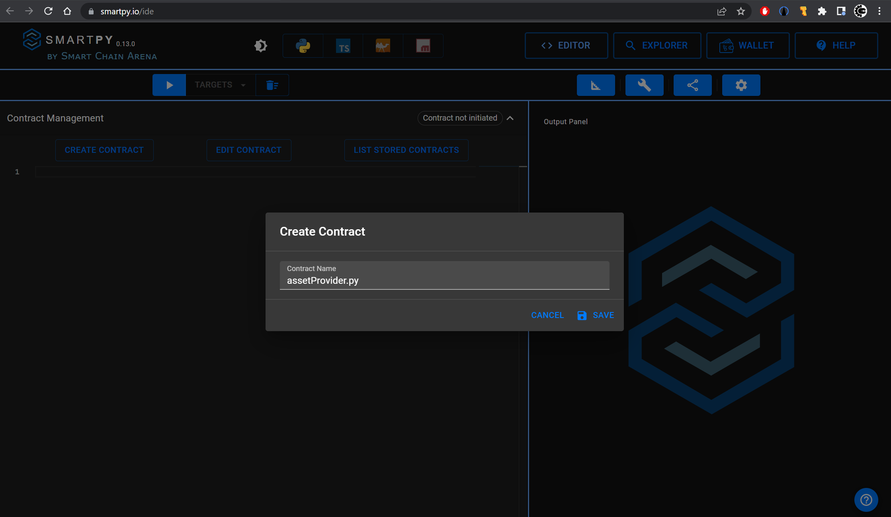

Following the definition, the contract code needs to be stored in the contract:

**assetProvider.py**
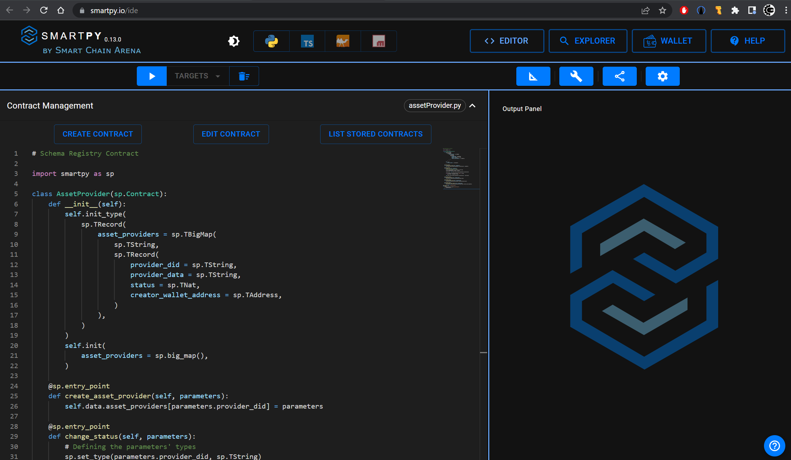

Repeat the process for all necessary contracts:

**assetProvidertRepository.py**
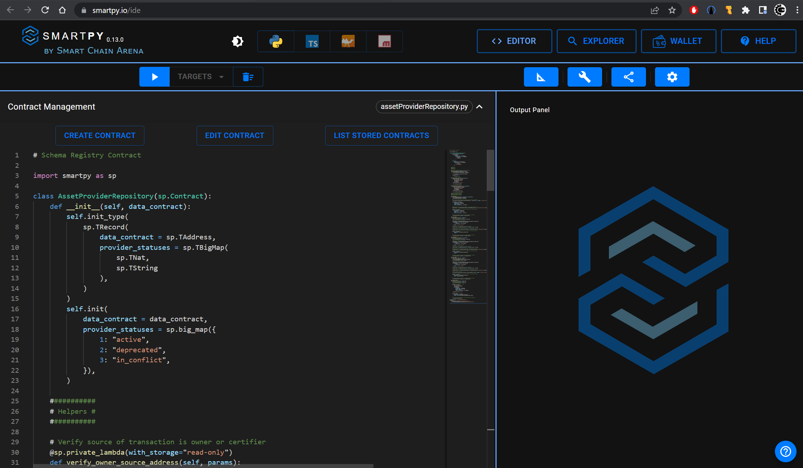

**assetTwinTracing.py**
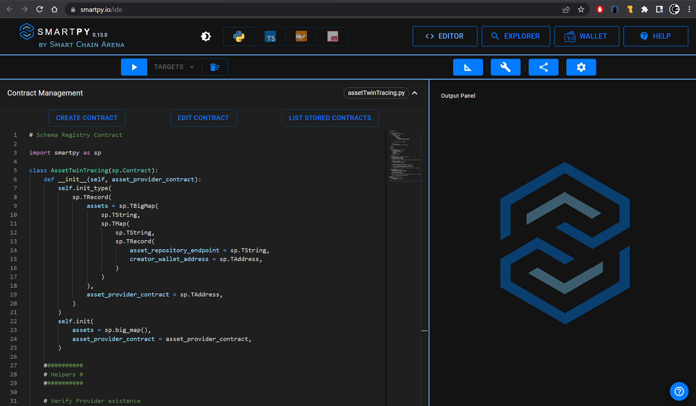

**LUW.py**
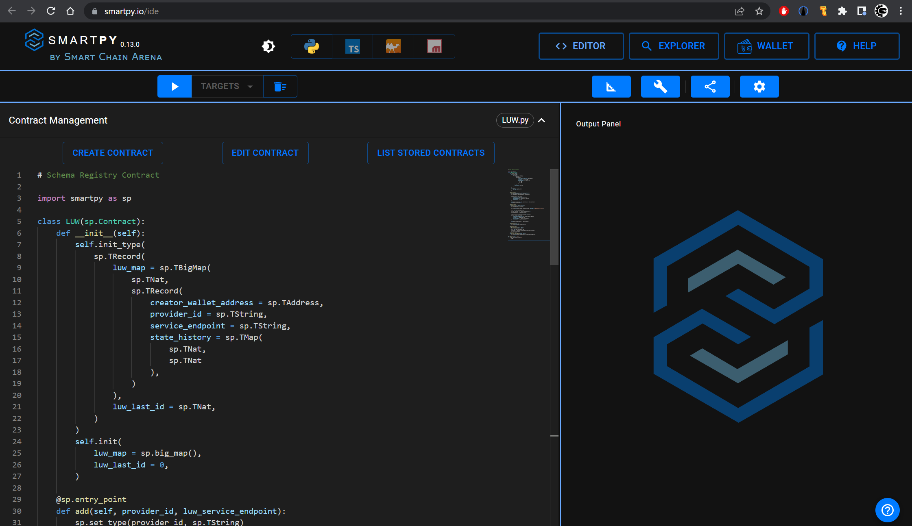

**LUWRepository.py**
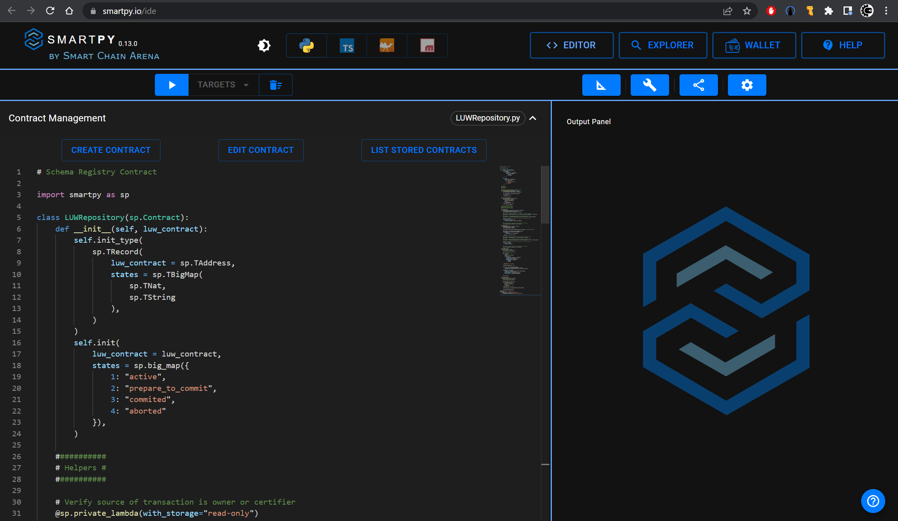

Finally, the test contract is created, which is the one that will be run:

**testSchenarios.py**
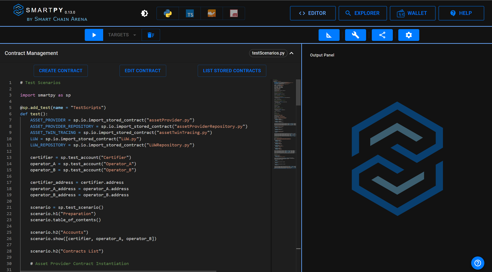

After all contracts are created, the following list can be seen in the List of Stored Contracts:
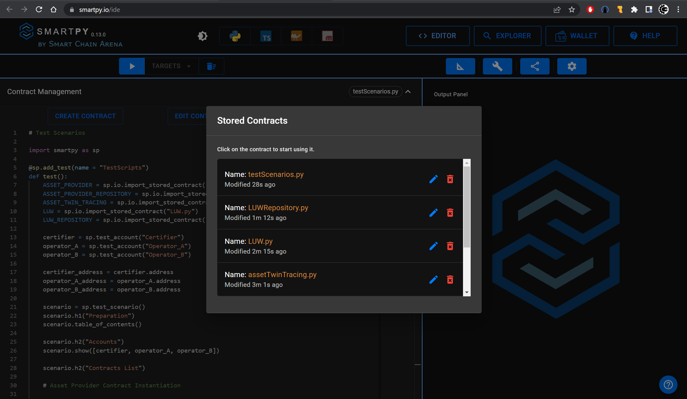

After the contracts are created and the test scenario is also created and loaded, if we hit run then all tests will be executed and the result of the several verification executions will be presented in the output window as follows:
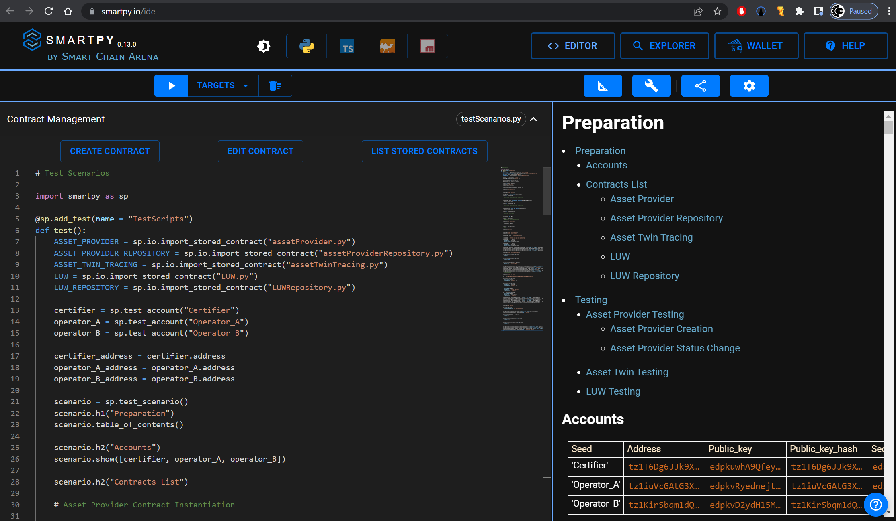

The list of the test results is presented in the output window:
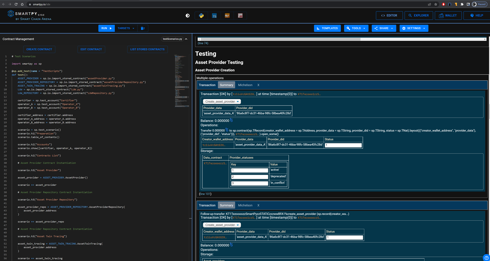

The difference in coloring between results is due to the verification type.
The blue-colored result verified the successful execution of a test, whereas the brown-colored verified a test case that leads to failure of execution.

For example, this is the test result for the successful flow of Set Provider Status operation , which was verified:
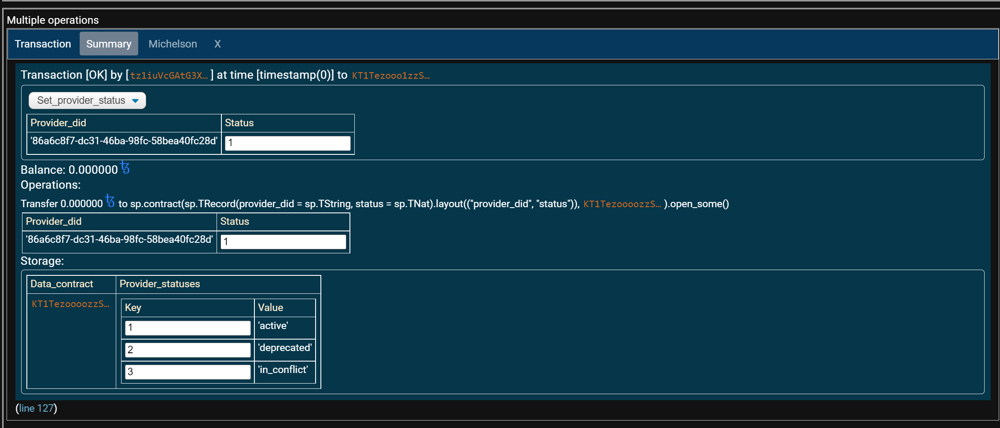

And this is the test result for the failed flow due to existing issuer of the Set Issuer Active operation, which also was verified that it is handled as expected:
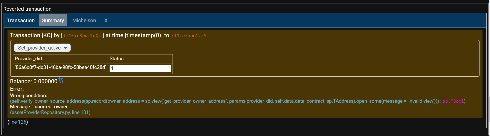

A test was implemented for the following cases:

### Expected Successful Cases

#### Asset Provider

##### Creation

**Scenarios**
|  Scenario |
| ------------ |
| Create Asset Provider with ID A |
| Verify Asset Provider creation with ID A |
| Create Asset Provider with ID B |
| Verify Asset Provider creation with ID B |

##### Management

**Scenarios**
|  Scenario |
| ------------ |
| Change Asset Provider Data with ID A |
| Verify Asset Provider Data change with ID A |
| Change Asset Provider Onwer with ID A to ID B |
| Verify Asset Provider Owner set to ID B |
| Change Asset Provider Onwer with ID B to ID A |
| Verify Asset Provider Owner set to ID A |

##### Status Update

**Scenarios**
|  Scenario |
| ------------ |
| Set Asset Provider with ID A as Deprecated with proper Owner (Operator A) |
| Verify Asset Provider status set to Deprecated |
| Set Asset Provider with ID A to Active Status with proper Owner (Operator A) |
| Verify Asset Provider status set to Active |

#### Asset Twin

##### Registration

**Scenarios**
|  Scenario |
| ------------ |
| Register Asset Twin with Hash A and Provider A |
| Verify Asset Twin creation with Hash A |
| Register Asset Twin with Hash A and Provider B |
| Register Asset Twin with Hash B and Provider A |
| Register Asset Twin with Hash A and Provider A |
| Verify Asset Twin creation with Hash B |
| Verify Failure of fetching an Asset Twin with valid Hash A and invalid Provider |

#### LUW

##### Creation

**Scenarios**
|  Scenario |
| ------------ |
| Create LUW |
| Verify LUW Owner |
| Verify LUW State |

##### Repository Management

**Scenarios**
|  Scenario |
| ------------ |
| Add Reposotory A to LUW A |
| Add Reposotory B to LUW A |
| Change Reposotory State A for LUW A to "Ready"|
| Verify Reposotory State A for LUW A set to "Ready"|

##### State Management

**Scenarios**
|  Scenario |
| ------------ |
| Alter LUW State to "Prepare to Commit" with proper Owner (Operator A) |
| Verify LUW State is set to "Prepare to Commit" |

### Expected Failed Cases

#### Asset Provider

##### Creation

**Scenarios**
|  Scenario | Failure Reason |
| ------------ | ------------ |
| Adding an existing Provider ID | Provider ID already exists |

##### Management

**Scenarios**
|  Scenario | Failure Reason |
| ------------ | ------------ |
| Changing provider data from incorrect wallet address | Non-matching owner address |
| Changing provider owner from incorrect wallet address | Non-matching owner address |

##### Status Update

**Scenarios**
|  Scenario | Failure Reason |
| ------------ | ------------ |
| Changing provider to Active status from incorrect wallet address | Non-matching owner address |
| Changing provider status from incorrect wallet address | Non-matching owner address |
| Changing provider status of a non-existing provider ID | Provider ID does not exist |

#### LUW

##### Repository Management

**Scenarios**
|  Scenario | Failure Reason |
| ------------ | ------------ |
| Adding a Repository to a non-active LUW | LUW is not Active |
| Adding a Repository to a LUW from an incorrect wallet address | Non-matching owner address |
| Changing a LUW Repository state from an incorrect wallet address | Non-matching owner address |
| Changing a LUW Repository state for a non-existing LUW ID | LUW ID does not exist |
| Changing a LUW Repository state to an invalid state ID | Incorrect state ID |
| Changing a LUW Repository state for a non-existing Repository | Repository ID does not exist |

##### State Management

**Scenarios**
|  Scenario | Failure Reason |
| ------------ | ------------ |
| Changing LUW state from incorrect wallet address | Non-matching owner address |
| Changing LUW state for a non-existing LUW ID | LUW ID does not exist |
| Changing LUW state to an invalid state ID | Incorrect state ID |